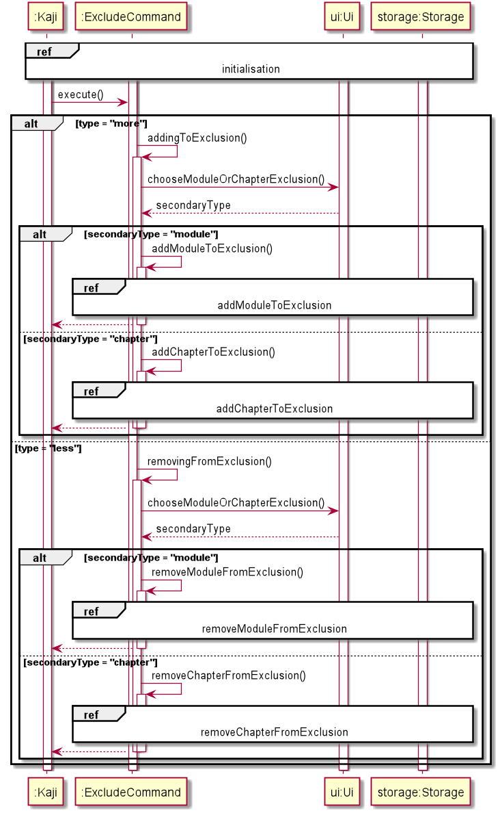
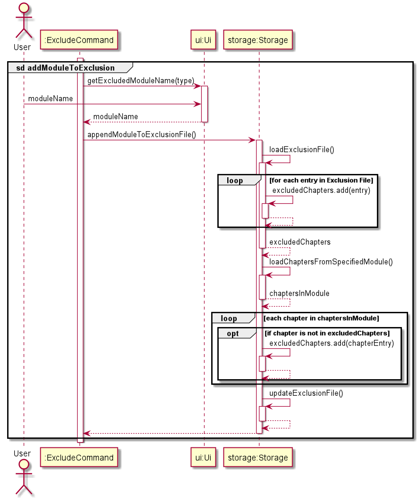
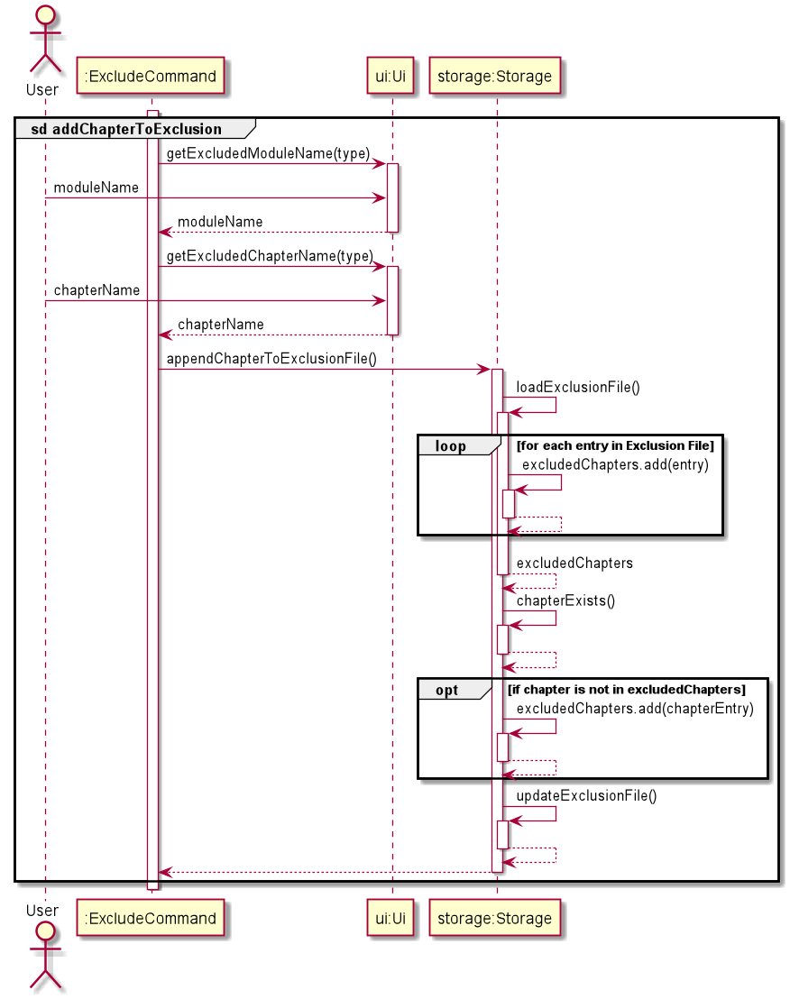
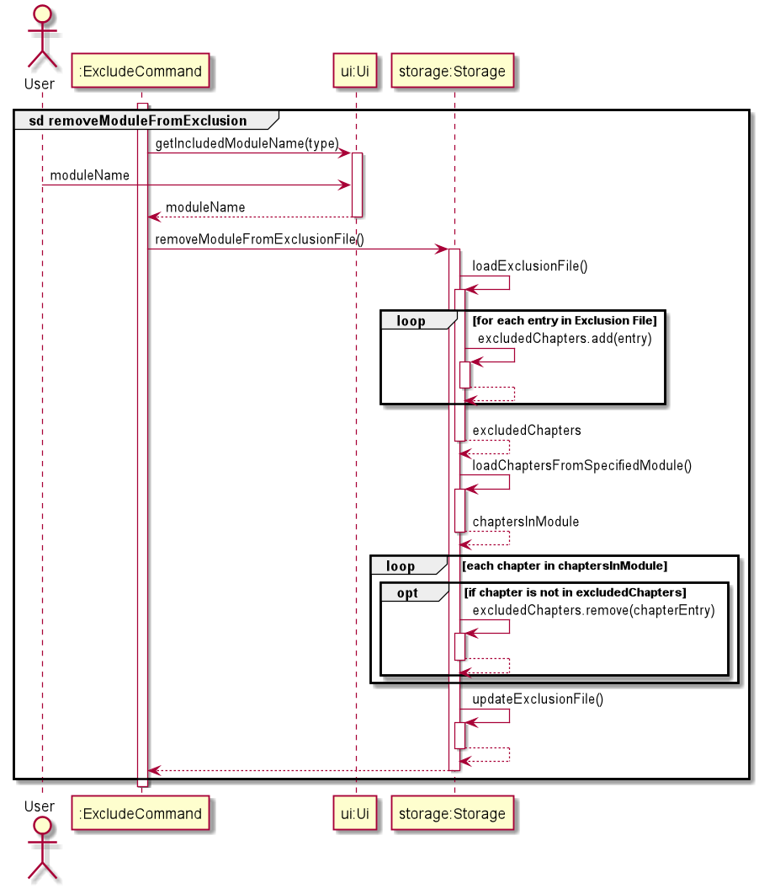
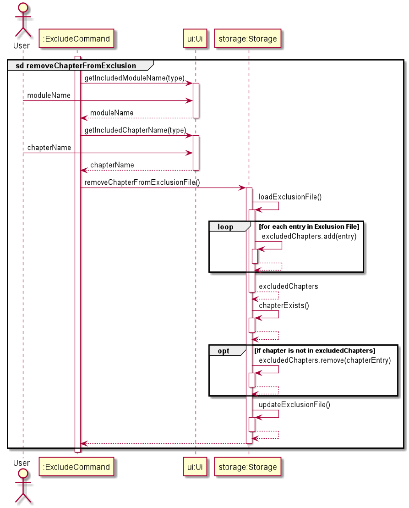

# Developer Guide

## Table of content
1. [<b>Introduction</b>](#1-introduction) 
1.1. [Overview](#11-overview) 
1.2. [Purpose](#12-purpose) 
1.3. [Scope](#13-scope) 
2. [<b>Setting Up</b>](#2-setting-up) 
2.1. [Prerequisites](#21-prerequisites) 
2.2. [Setting Up the Project in your Computer](#22-setting-up-the-project-in-your-computer) 
3. [<b>Design (Architecture)</b>](#3-design-architecture) 
3.1. [Ui Component](#31-ui-component) 
3.2. [Logic Component](#32-logic-component) 
3.3. [Model Component](#33-model-component) 
3.4. [Storage Component](#34-storage-component) 
3.5. [Common Classes](#35-common-classes) 
4. [<b>Implementation</b>](#4-implementation) 
4.1. [Admin Features](#41-admin-features) 
&nbsp;&nbsp;&nbsp;&nbsp;&nbsp;&nbsp;&nbsp;4.1.1. [Add Module Feature](#411-add-module-feature) 
&nbsp;&nbsp;&nbsp;&nbsp;&nbsp;&nbsp;&nbsp;4.1.2. [List Modules Feature](#412-list-modules-feature) 
&nbsp;&nbsp;&nbsp;&nbsp;&nbsp;&nbsp;&nbsp;4.1.3. [Edit Module Name Feature](#413-edit-module-name-feature) 
&nbsp;&nbsp;&nbsp;&nbsp;&nbsp;&nbsp;&nbsp;4.1.4. [Remove Module Feature](#414-remove-module-feature) 
&nbsp;&nbsp;&nbsp;&nbsp;&nbsp;&nbsp;&nbsp;4.1.5. [Access Module Level Feature](#415-access-module-level-feature) 
&nbsp;&nbsp;&nbsp;&nbsp;&nbsp;&nbsp;&nbsp;4.1.6. [Example of the Admin Feature](#416-example-of-the-admin-feature) 
&nbsp;&nbsp;&nbsp;&nbsp;&nbsp;&nbsp;&nbsp;4.1.7. [Conclusion](#417-conclusion) 
4.2. [Module Features](#42-module-features) 
&nbsp;&nbsp;&nbsp;&nbsp;&nbsp;&nbsp;&nbsp;4.2.1. [Add Chapter Feature](#421-add-chapter-feature) 
&nbsp;&nbsp;&nbsp;&nbsp;&nbsp;&nbsp;&nbsp;4.2.2. [List Chapters Feature](#422-list-chapters-feature) 
&nbsp;&nbsp;&nbsp;&nbsp;&nbsp;&nbsp;&nbsp;4.2.3. [Edit Chapter Name Feature](#423-edit-chapter-name-feature) 
&nbsp;&nbsp;&nbsp;&nbsp;&nbsp;&nbsp;&nbsp;4.2.4. [Remove Chapter Feature](#424-remove-chapter-feature) 
&nbsp;&nbsp;&nbsp;&nbsp;&nbsp;&nbsp;&nbsp;4.2.5. [Access Chapter Level Feature](#425-access-chapter-level-feature) 
&nbsp;&nbsp;&nbsp;&nbsp;&nbsp;&nbsp;&nbsp;4.2.6. [Return to Admin Level Feature](#426-return-to-admin-level-feature) 
&nbsp;&nbsp;&nbsp;&nbsp;&nbsp;&nbsp;&nbsp;4.2.7. [Rate Chapter Feature](#427-rate-chapter-feature) 
&nbsp;&nbsp;&nbsp;&nbsp;&nbsp;&nbsp;&nbsp;4.2.8. [Example of the Module Feature](#428-example-of-the-module-feature) 
&nbsp;&nbsp;&nbsp;&nbsp;&nbsp;&nbsp;&nbsp;4.2.9. [Conclusion](#429-conclusion) 
4.3. [Chapter Features](#43-chapter-features) 
&nbsp;&nbsp;&nbsp;&nbsp;&nbsp;&nbsp;&nbsp;4.3.1. [Add Flashcard Feature](#431-add-flashcard-feature) 
&nbsp;&nbsp;&nbsp;&nbsp;&nbsp;&nbsp;&nbsp;4.3.2. [List Flashcards Feature](#432-list-flashcards-feature) 
&nbsp;&nbsp;&nbsp;&nbsp;&nbsp;&nbsp;&nbsp;4.3.3. [Edit Flashcard Content Feature](#433-edit-flashcard-content-feature) 
&nbsp;&nbsp;&nbsp;&nbsp;&nbsp;&nbsp;&nbsp;4.3.4. [Remove Flashcard Feature](#434-remove-flashcard-feature) 
&nbsp;&nbsp;&nbsp;&nbsp;&nbsp;&nbsp;&nbsp;4.3.5. [Return to Module Level Feature](#435-return-to-module-level-feature) 
&nbsp;&nbsp;&nbsp;&nbsp;&nbsp;&nbsp;&nbsp;4.3.6. [Check Overall Performance for a Chapter Feature](#436-check-overall-performance-for-a-chapter-feature) 
&nbsp;&nbsp;&nbsp;&nbsp;&nbsp;&nbsp;&nbsp;4.3.7. [Example of the Chapter Feature](#437-example-of-the-chapter-feature) 
&nbsp;&nbsp;&nbsp;&nbsp;&nbsp;&nbsp;&nbsp;4.3.8. [Conclusion](#438-conclusion) 
4.4. [Revision Features](#44-revision-feature) 
&nbsp;&nbsp;&nbsp;&nbsp;&nbsp;&nbsp;&nbsp;4.4.1. [Revision Feature](#441-revision-feature) 
4.5. [Scheduler feature](#45-scheduler-feature) 
&nbsp;&nbsp;&nbsp;&nbsp;&nbsp;&nbsp;&nbsp;4.5.1. [View Due Chapters Feature](#451-view-due-chapters-feature) 
&nbsp;&nbsp;&nbsp;&nbsp;&nbsp;&nbsp;&nbsp;4.5.2. [Preview Upcoming Dues Feature](#452-preview-upcoming-dues-feature) 
&nbsp;&nbsp;&nbsp;&nbsp;&nbsp;&nbsp;&nbsp;4.5.3. [Exclusion Feature](#453-exclusion-feature) 
&nbsp;&nbsp;&nbsp;&nbsp;&nbsp;&nbsp;&nbsp;4.5.4. [Reschedule Chapter Feature](#454-reschedule-chapter-feature) 
&nbsp;&nbsp;&nbsp;&nbsp;&nbsp;&nbsp;&nbsp;4.5.5. [View Revision History Feature](#455-view-revision-history-feature) 
5. [<b>Appendix: Requirements</b>](#5-appendix-requirements) 
5.1. [Product Scope](#51-product-scope) 
&nbsp;&nbsp;&nbsp;&nbsp;&nbsp;&nbsp;&nbsp;5.1.1. [Target User Profile](#511-target-user-profile) 
&nbsp;&nbsp;&nbsp;&nbsp;&nbsp;&nbsp;&nbsp;5.1.2. [Value Proposition](#512-value-proposition) 
5.2. [User Stories](#52-user-stories) 
5.3. [Use Cases](#53-use-cases) 
5.4. [Non-Functional Requirements](#54-non-functional-requirements) 
5.5. [Glossary](#55-glossary) 
6. [<b>Appendix: Instructions for Manual Testing</b>](#6-appendix-instructions-for-manual-testing) 

--------------------------------------------------------------------------------------------------------------------

## 1. Introduction

### 1.1. Overview

### 1.2. Purpose

### 1.3. Scope
This documentation describes the software architecture and software design decisions for the implementation of Kaji. The intended audience of this document is the developers, designers, and software testers of Kaji.

--------------------------------------------------------------------------------------------------------------------

## 2. Setting Up

### 2.1. Prerequisites
* JDK 11
* IntelliJ IDEA
### 2.2. Setting up the project in your computer
1. Fork this repository, and clone the fork into your computer.
2. Open IntelliJ (if you are not in the welcome screen, click `File` → `Close Project` to close the existing project dialog first).
3. Set up the correct JDK version for Gradle.
    1. Click `Configure` → `Project Defaults` → `Project Structure`.
    2. Click `New…` and set it to the directory of the JDK.
4. Click `Import Project` (or `Open or Import` in newer version of Intellij).
5. Locate the `build.gradle` file (not the root folder as you would do in a normal importing) and select it. Click `OK`.
If asked, choose to `Open as Project` (not `Open as File`).
7. Click `OK` to accept the default settings

--------------------------------------------------------------------------------------------------------------------

## 3. Design (Architecture)
(Zeyu)

The Architecture Diagram given above explains the high-level design of the App. Given below is a quick overview of each component.

The main class is `Kaji.java`. It is responsible for:

* Initializing the components in the correct sequence, and connects them up with each other at app launch.
* Shutting down the components and invoking cleanup methods where necessary at exit.

The rest of the App consists of 8 components:
* `Access`: Keeps track of the access level of the user.
* `UI`: The UI of the App.
* `Command`: Executes the different command types.
* `Common`: Contains common classes.
* `Manager`: Holds the data of the App in memory.
* `Paser`: Parses user input into specific command type.
* `Scheduler`: Schedules the revision schedule.
* `Storage`: Reads data from, and writes data to, the hard disk.

### 3.1. Ui Component 
(Jia Ern)

### 3.2. Logic Component 
(Jane)

### 3.3. Model Component
(Jiayi)

### 3.4. Storage Component 
(Lucas)

### 3.5. Common Classes

--------------------------------------------------------------------------------------------------------------------

## 4. Implementation

### 4.1. Admin Features
[summary + scenario]

#### 4.1.1. Add Module Feature
(Jiayi)

#### 4.1.2. List Modules Feature
(Zeyu)

#### 4.1.3. Edit Module Name Feature
(Jane)

#### 4.1.4. Remove Module Feature
(Jia Ern)

#### 4.1.5. Access Module Level Feature
(Jiayi)

#### 4.1.6. Example of the Admin Feature

#### 4.1.7. Conclusion

### 4.2. Module Features
[summary + scenario]

#### 4.2.1. Add Chapter Feature
(Jiayi)

#### 4.2.2. List Chapters Feature
(Zeyu)

#### 4.2.3. Edit Chapter Name Feature
(Jane)

#### 4.2.4. Remove Chapter Feature
(Jia Ern)

#### 4.2.5. Access Chapter Level Feature
(Lucas)

#### 4.2.6. Return to Admin Level Feature
(Lucas)

#### 4.2.7. Rate Chapter Feature
(Jiayi) 

#### 4.2.8. Example of the Module Feature

#### 4.2.9. Conclusion

### 4.3. Chapter Features
[summary + scenario]

#### 4.3.1. Add Flashcard Feature
(Jane)

#### 4.3.2. List Flashcards Feature
(Zeyu)

#### 4.3.3. Edit Flashcard Content Feature
(Jane)

#### 4.3.4. Remove Flashcard Feature
(Jia Ern)

#### 4.3.5. Return to Module Level Feature
(Jia Ern)

#### 4.3.6. Check Overall Performance for a Chapter Feature
(Jiayi)

#### 4.3.7. Example of the Chapter Feature

#### 4.3.8. Conclusion

### 4.4. Revision Feature
[summary + scenario]

#### 4.4.1. Revision Feature
(Jia Ern)

#### 4.4.2. Scheduling The Chapters Feature
In KAJI, each `Chapter` stores a `CardList` of `Card`s, each with their own `int` attribute `previousInterval`. Each `Chapter` also has a `LocalDate` attribute named `dueBy` that determines when the `Chapter` is due for revision. 
At the end of a revision session, the `Scheduler` class implements Spaced Repetition by computing the `deckInterval`, the mean (rounded off to the nearest integer) of the `previousInterval`s of every `Card` within the `Chapter`, and updates the `dueBy` attribute to `deckInterval` days after the day of revision.

`Scheduler` implements the following operations:
* `Scheduler#computeEasyInterval()`
* `Scheduler#computeMediumInterval()`
* `Scheduler#computeHardInterval()`
* `Scheduler#computeDeckInterval()`
* `Scheduler#computeDeckDeadline()`

`Scheduler#computeEasyInterval()`, `Scheduler#computeMediumInterval()` and `Scheduler#computeHardInterval()` are exposed in the `ReviseCommand` class as `ReviseCommand#rateCard()` while `Scheduler#computeDeckDeadline()` is exposed as `ReviseCommand#execute()`.

***Example***
Given below is an example usage scenario and how the Scheduler mechanism behaves at each step when: 
`revise 1` is called in a `Module` that contains only one `Chapter` with three `Card`s in its `CardList` attribute and confirmation is given to proceed with revision.

Step 1:
* The user enters `revise 1` within the `Module` and `ReviseCommand` is instantiated. 
* Upon confirmation and check that `CardList` of the designated `Chapter` is not empty, `ReviseCommand` proceeds to create an `ArrayList<Card>` named `allCards` comprising of all `Card`s within in the `CardList`.

Step 2:
* For each `Card` in `allCards`, `ReviseCommand#reviseCard()` is called upon completion of either `ReviseCommand#execute()` or `ReviseCommand#repeateRevision()`.
* This operation then calls `Scheduler#computeEasyInterval()`, `Scheduler#computeMediumInterval()` or `Scheduler#computeHardInterval()` depending on the user input to compute and update the new value of `previousInteral` for each card.

Step 3:
* Upon completion of all revision, `ReviseCommand#execute()` will call `Scheduler#computeDeckDeadline()`, which in turn calls `Scheduler#computeDeckInterval()`. `Scheduler#computeDeckInterval()` computes `deckInterval`, the mean (rounded off to the nearest integer) of the `previousInterval`s of each `Card` in `allCards,` and returns it to `Scheduler#computeDeckDeadline()`.

Step 4:
* Using `deckInterval`, `Scheduler#computeDeckDeadline()` computes the new value of `dueBy` for the Chapter, which is then returned to `ReviseCommand#execute()`, where it will then update the value of `dueBy` for the `Chapter` that was just revised.

### 4.5. Viewing and Customising the Schedule Feature
KAJI schedules the user's database automatically for them based on their [revision sessions](#), chapter by chapter, using Spaced Repetition. Users should be able to view their schedule for the current day to know which tasks they need to complete on the day itself and to view their schedule for the upcoming week so that they can plan ahead. However, to effectively use the scheduling feature, users should also be able to customise their scheduling system to include or exclude chapters from their schedule with ease.

To utilise this feature, the following commands and their corresponding sub-features are introduced:
* [`due`](#451-View-Due-Chapters-Feature) - Viewing their schedule for the current day
* [`preview`](#452-Preview-Upcoming-Dues-Feature) - Viewing their schedule for the upcoming week
* [`exclude`](#453-Exclusion-Feature) - Customising which of their Chapters will be in the Scheduler

#### 4.5.1. View Due Chapters Feature
(Lucas)

#### 4.5.2. Preview Upcoming Dues Feature
(Lucas)

#### 4.5.3. Exclusion Feature
(Lucas)

***Implementation***
KAJI allows users to customise which Chapters are to be excluded from their scheduling by maintaining an Exclusion List: a list of Chapters that KAJI will ignore as it parses for Chapters that are due in the `due` and `preview` commands. This is to allow users to exclude and include `Chapter`s from and to their schedules without having to remove and add the `Chapter`s from their database, which can be tedious.

To support this feature, the following command was added to KAJI:
* `exclude` - A command that excludes more or less `Chapters` from the Exclusion List.
A corresponding Class `ExecuteCommand` was also created to carry out the functions related to the command.

The `exclude` command can be called with either `exclude more` or `exclude less`, which adds to or removes from the Exclusion List respectively. Furthermore, both modes can be used to edit the Exclusion List a single `Chapter` at a time or every `Chapter` belonging to a `Module` at a time as a secondary option.

To load and store the Exclusion List, a Exclusion File is created and maintained using these two methods from the `Storage` Class:
* `Storage#loadExclusionFile` - Reads the contents of the Exclusion File, parses it into the Exclusion List, stored as a `ArrayList<String>`, and returns it.
* `Storage#updateExclusionFile` - Writes the `ArrayList<String>` Exclusion List into the Exclusion File.

The `ArrayList<String>` Exclusion List is modified using four pairs of commands in both `ExcludeCommand` and `Storage`:

* Excluding a Chapter from Scheduling
    * `ExcludeCommand#addChapterToExclusion`
    * `Storage#appendChapterToExclusionFile`
* Excluding a Module from Scheduling
    * `ExcludeCommand#addModuleToExclusion`
    * `Storage#appendModuleToExclusionFile`
* Including a Chapter from Scheduling
    * `ExcludeCommand#removeChapterFromExclusion`
    * `Storage#aremoveChapterFromExclusionFile`
* Including a Module from Scheduling
    * `ExcludeCommand#removeModuleFromExclusion`
    * `Storage#removeModuleFromExclusionFile`

The following sequence Diagrams illustrates how the Exclusion Process is executed:

 

 

 

 

 

#### 4.5.4. Reschedule Chapter Feature
(Jane)

#### 4.5.5. View Revision History Feature
(Zeyu)

--------------------------------------------------------------------------------------------------------------------

## 5. Appendix: Requirements
### 5.1. Product Scope
#### 5.1.1. Target User Profile

* needs to have an effective study schedule
* prefers typing to mouse interactions
* is comfortable with the usage of CLI applications

#### 5.1.2. Value Proposition

* implements Spaced Repetition for the user 

### 5.2. User Stories

|Version| As a ... | I want to ... | So that I can ...|
|--------|----------|---------------|------------------|
|v1.0|user|revise the flashcards by chapter|do my revision|
|v1.0|user|remove modules/chapters/flashcard|remove modules/chapters/flashcards that I no longer need from the scheduler|

### 5.3. Use Cases

### 5.4. Non-Functional Requirements

1. Should work on any mainstream OS as long as it has Java 11 installed.
2. A user with above average typing speed for regular English text (i.e. not code, not system admin commands) should be able to accomplish most of the tasks faster using commands than using the mouse.

### 5.5. Glossary

* **Mainstream OS**: Windows, Linux, Unix, OS-X
* **CLI**: Command Line Interface

--------------------------------------------------------------------------------------------------------------------

## 6. Appendix: Instructions for Manual Testing

{Give instructions on how to do a manual product testing e.g., how to load sample data to be used for testing}